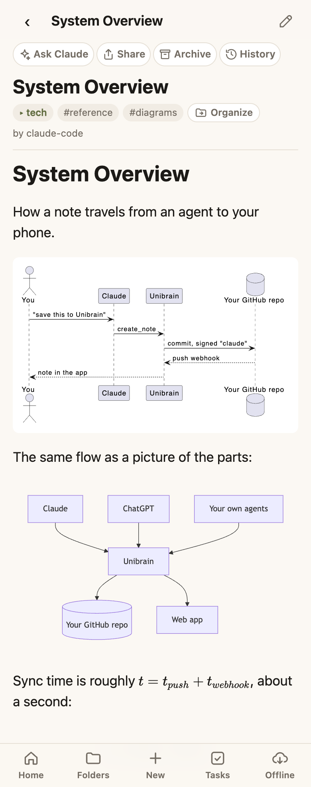
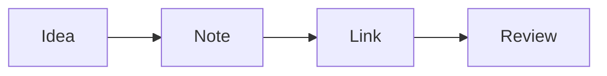

# Diagrams and math

Ask for a picture instead of a paragraph. Write a fenced code block whose language is the diagram type, and the web app draws it. Tap any diagram to view it full screen and zoom.

<div class="shots" markdown>
<figure markdown>

<figcaption>PlantUML, Mermaid and math in one note</figcaption>
</figure>
</div>

````markdown

````


## 26 diagram types

| Kind | Types |
|---|---|
| **Flowcharts, sequences, UML** | `mermaid`, `plantuml`, `nomnoml`, `umlet`, `seqdiag`, `actdiag`, `blockdiag` |
| **Architecture** | `c4plantuml` (or `c4`), `structurizr`, `d2`, `graphviz` (or `dot`) |
| **Data and databases** | `erd`, `dbml`, `vega`, `vegalite` |
| **Sketches from ASCII art** | `ditaa`, `svgbob`, `pikchr` |
| **Networks and hardware** | `nwdiag`, `packetdiag`, `rackdiag`, `wireviz`, `wavedrom`, `bytefield`, `symbolator` |
| **LaTeX drawings** | `tikz` |

Mermaid is drawn in your browser; the others are drawn by the server with [Kroki](https://kroki.io). All of them **keep working offline** once a note has been opened.

!!! tip "Let your agents draw"
    Agents are told about every diagram type when they connect. Ask *"draw this as a C4 container diagram"* or *"chart my commits per week as a Vega-Lite line chart"*.

## Math

Inline `$E = mc^2$` and display math with `$$ … $$`, rendered with KaTeX:

$$
\int_0^\infty e^{-x^2}\,dx = \frac{\sqrt{\pi}}{2}
$$

## Code

Fenced code blocks are syntax-highlighted for 190+ languages.
