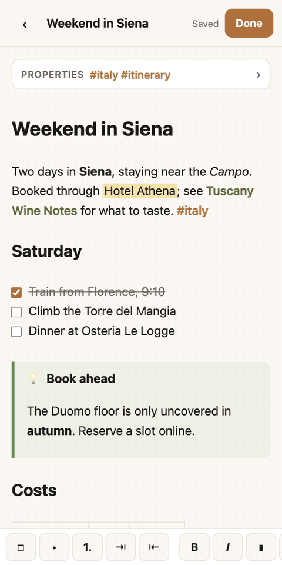
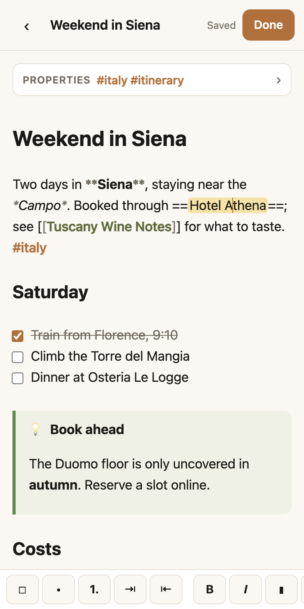
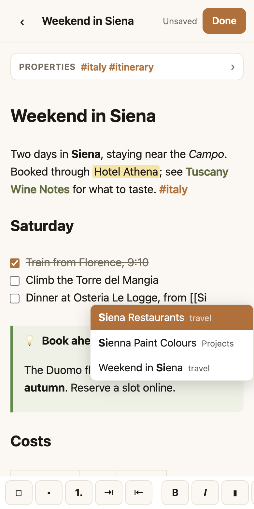
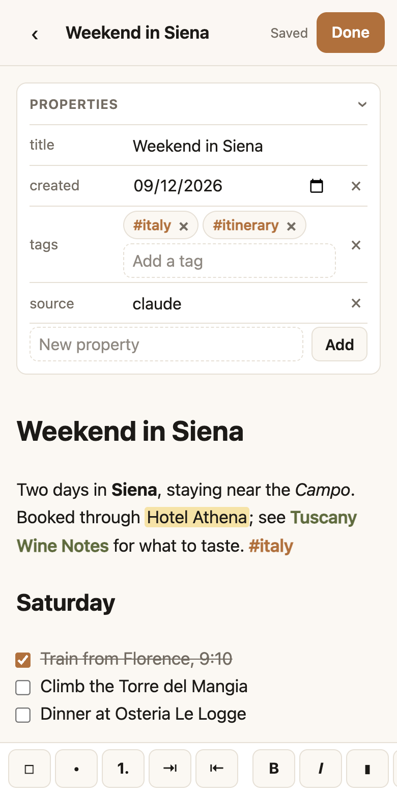

# Writing

The editor shows your note **formatted while you type**. Headings are sized, bold is bold, links show their names and checkboxes can be ticked. Only the line you're on shows its Markdown, so you can still edit it exactly. What's saved is plain Markdown, the same file your agents read.

<figure markdown>

<figcaption>Formatted as you type</figcaption>
</figure>
<figure markdown>

<figcaption>The line you're on shows its Markdown</figcaption>
</figure>

Open any note and tap **Edit** (the pencil).

## Live Preview

- **Text styles** are shown as they will look: bold, italic, highlight, strikethrough, inline code. Their marks (`**`, `==`, and so on) are hidden until your cursor is on the line.
- **Links** show the note's name or the link's text. Tapping one puts the cursor in it so you can change it; links are followed in the reading view.
- **Lists:** bullets are dots, and task checkboxes are real boxes you can tick.
- **Blocks** are drawn exactly as in the reading view: callouts, tables, [diagrams and math](diagrams.md), and pictures. Tap one to edit its Markdown; tap elsewhere and it is drawn again.
- **MD**, at the end of the toolbar, switches to the raw Markdown and back. Your choice is remembered on each device.

## The toolbar

On a phone the toolbar sits on top of the keyboard; on a computer it is above the note. Swipe it sideways for more.

| Button | What it does |
|---|---|
| ☐ • 1. | Checkbox, bullet and numbered list |
| ⇥ ⇤ | Indent and outdent, to nest list items |
| **B** *I* ▮ ~~S~~ `</>` | Bold, italic, highlight, strikethrough, code |
| H | Heading: tap again for a smaller one, and again to remove it |
| `[[ ]]` 🔗 `#` | Link to a note, web link, tag |
| 📷 | Add a picture |
| ⋯ | More: insert a quote, callout, code block, table, divider, Mermaid diagram or today's date; **Find and replace**; go to the top or the end; word count |
| ↶ ↷ | Undo and redo |
| MD | Show the raw Markdown |

Tapping a formatting button twice puts the text back as it was. With text selected, **Code block** and **Callout** go around it.

On a computer: ++cmd+b++ bold, ++cmd+i++ italic, ++cmd+k++ web link, ++cmd+shift+k++ note link, ++cmd+f++ find, ++cmd+z++ undo.

## Lists that continue

- Press **Return** after a bullet, a number or a checkbox and the next one is started for you. Numbers count up.
- Press **Return** on an empty item to leave the list.
- **Tab** and **Shift-Tab**, or ⇥ and ⇤, nest an item under the one above and bring it back.

## Suggestions

<figure markdown>

<figcaption>Type <code>[[</code> to link a note</figcaption>
</figure>
<figure markdown>

<figcaption>Properties as a form</figcaption>
</figure>

- Type **`[[`** and your notes are listed, narrowed as you type, with each note's folder beside it. Choose one and the link is completed.
- Type **`[[Note#`** to choose one of that note's headings.
- Type **`#`** and a letter to choose from the tags you already use.
- A link to a note that **doesn't exist yet** is shown faded. In the reading view, tap it to create that note.

## Properties

A note's properties (its title, tags, dates and anything else in the block at the top) are a form, not text.

- It starts **closed**, as one line showing the note's tags. Tap it to open.
- **Tags** are chips: type one and press Return, with your existing tags suggested. Tap × to remove one.
- Dates have a **date picker**, true/false values a **checkbox**.
- **Add** a property by name at the bottom; remove one with the × on its row. The title can be changed but not removed.
- Only the property you change is rewritten. The rest of the block, its order and its formatting stay exactly as your agents wrote them.

The raw block is always there under **MD**.

## Pictures

Tap 📷 to take a photo or choose one from your library. On a computer you can also paste a picture or drag it in.

- Large photos are **made smaller on your device** before they are sent, so your vault stays light.
- The picture is saved in an `attachments` folder next to the note and appears where your cursor was.
- PNG, JPEG, GIF, WebP and SVG, up to 10 MB.

## Saving

- The note **saves by itself** about 3 seconds after you stop typing. The top of the screen shows *Unsaved*, then *Saved*.
- It also saves when you tap **Done**, leave the note or switch apps.
- If someone else, such as an agent, changed the note while you were editing, **nothing is overwritten**: you choose their version or yours.
- Opening a note and closing it again without typing changes nothing.
- Editing needs a connection; [offline](offline.md), notes are read-only.

Every save is a version you can look back at in the note's [History](web-app.md#history).
