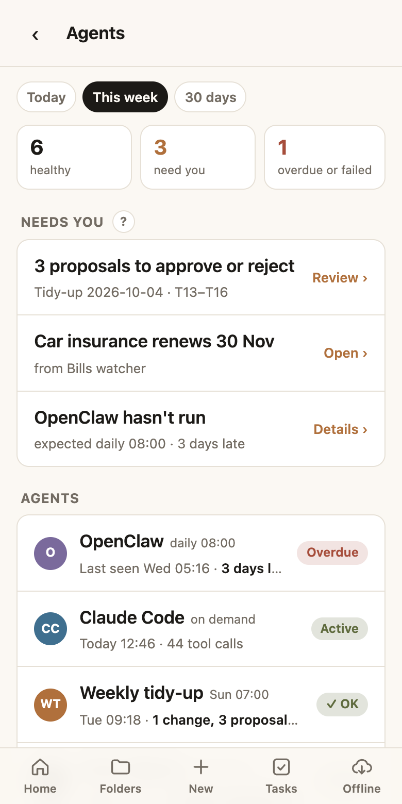
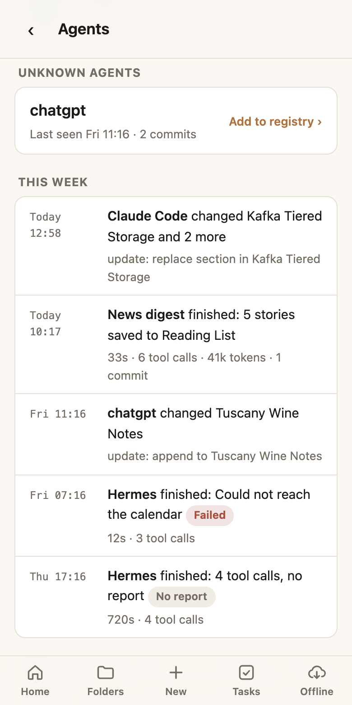
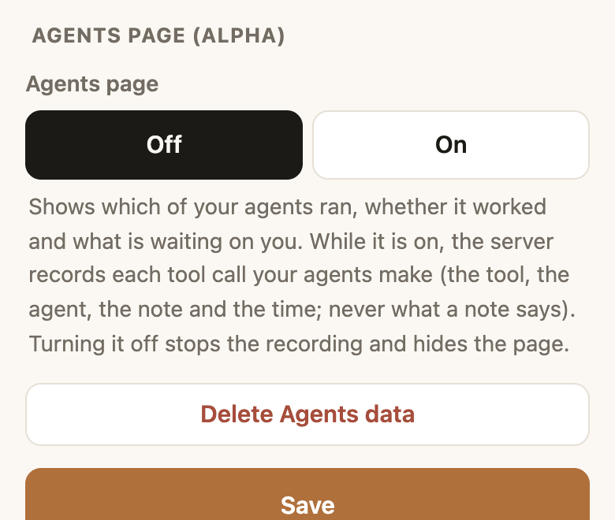
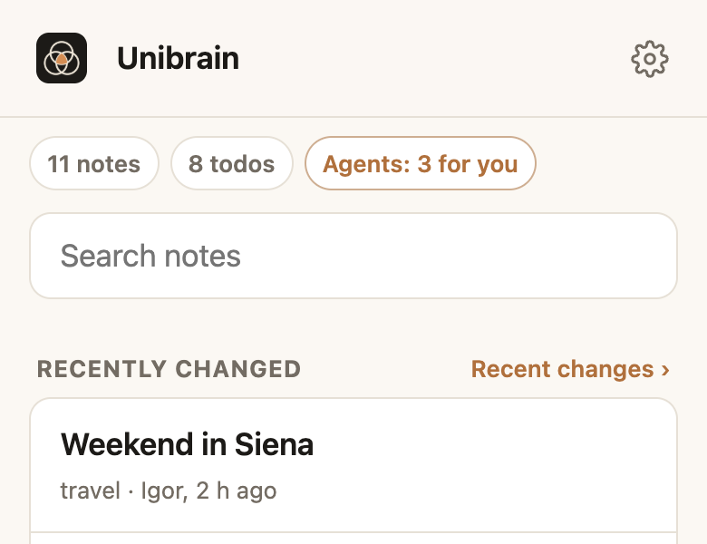
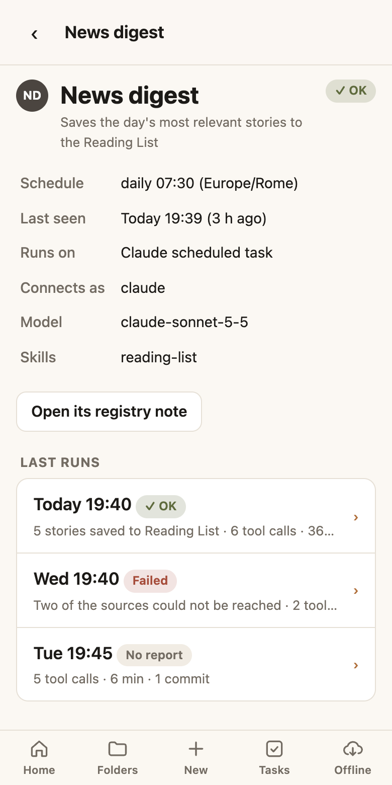
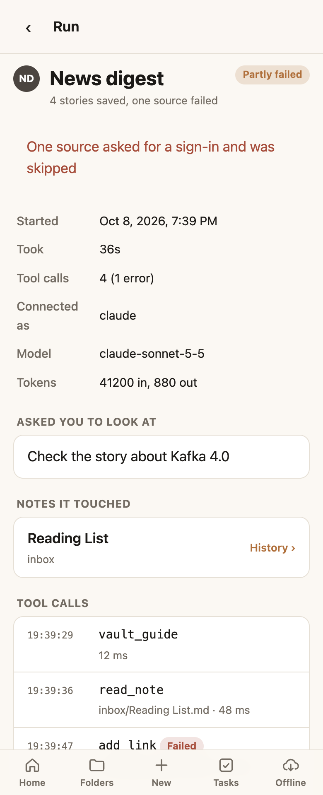

# Mission control (alpha)

!!! warning "Alpha: optional, and still changing"
    Mission control is an **advanced, optional** feature. It is **off** unless you turn it on, and nothing else in Unibrain depends on it. It is at an **alpha** stage: it works, but it has had little real use, and its screens, its settings and the names in the registry notes may change without notice. Try it, and [say what you find](https://github.com/blanzp/second-brain-docs/issues).

Mission control is an **Agents page** in the web app. For every agent you run, it shows whether the agent **ran**, whether it **worked**, what it **changed**, and what is **waiting on you**.

<div class="shots" markdown>
<figure markdown>

<figcaption>The Agents page</figcaption>
</figure>
<figure markdown>

<figcaption>Unknown agents, and the timeline</figcaption>
</figure>
</div>

## Who it's for

You don't need this to use Unibrain with an AI assistant. It earns its place once you have **several agents working without you watching**: a scheduled task that checks your bills on Mondays, a weekly tidy-up agent, a morning briefing, a bot on a server at home.

The problem it solves is silence. An agent that works leaves notes and commits behind. An agent that **crashes, loses its sign-in or never starts** leaves nothing, and nothing is exactly what a quiet week looks like too. Without mission control, finding out means opening each tool's own history and comparing dates.

With it, one screen answers:

- **Did it run?** A scheduled agent that missed its time shows as **Overdue**, without the agent having to say anything.
- **Did it work?** Each agent ends its run with a status and one line you can read on your phone: *"1 new bill, due 30 Nov"*.
- **What did it change?** Each run lists the notes it touched, with a link to their [History](web-app.md#history).
- **What needs me?** Proposals waiting for your tick, things an agent asked you to look at, and agents that failed, in one list.

It suits a person running their own agents. It is not a monitoring product: there are no alerts to your phone yet, and it only knows about what agents do **through Unibrain**.

## How it works

1. **You describe each agent in a note**, in a folder of your vault called the registry.
2. **Unibrain records each tool call** your agents make: which tool, which agent, which note, when, and whether it failed. Calls made close together by one agent are grouped into a **run**.
3. **Each agent ends its run by calling `report_run`**, with a status and a one-line summary. An agent that doesn't is still shown: its run closes by itself after two hours, marked *No report*.
4. **The page works out each agent's state** when you open it, from the schedule in its note and what was recorded. Nothing sends a heartbeat: a missed run is found by its absence.

Git activity counts as well. An agent that pushed a commit at its scheduled time is treated as having run, even if no tool call was recorded.

## Turn it on

Open **⚙ Settings**, scroll to **Agents page (alpha)**, choose **On** and save.

<div class="shots" markdown>
<figure markdown>

<figcaption>The switch, in Settings</figcaption>
</figure>
<figure markdown>

<figcaption>Home gains a figure for your agents</figcaption>
</figure>
</div>

The home screen's row of pills gains a third one, which opens the page:

| It says | Meaning |
|---|---|
| *Agents: OK* | Nothing needs you |
| *Agents: 3 for you* (amber) | Three items are in the Needs you list |
| *Agents: 1 failing* (red) | An agent missed its time, or reported a failure |

Turning it **off** hides the page and the figure and stops the recording at once. What was recorded is kept, and shown again if you turn it back on. **Delete Agents data** removes it for good.

!!! note "If the switch isn't there"
    The person who runs your Unibrain server chooses whether mission control is offered at all. On a server where it isn't, Settings has no such section.

## Set up your vault: the registry

The registry is a folder of notes, **one note per agent**. By default it is `Agents/Registry/`. They are ordinary notes, so you can add and edit them on your phone, and your agents can read them.

Create a note named after the agent and give it these properties (in the editor: the **Properties** form, or **MD** to paste them):

```yaml
---
title: Bills watcher
tags: [reference, agent]
agent_id: bills-watcher
description: Checks for new utility bills and tax notices each week
host: Claude scheduled task
app: claude
match: [Bills watcher]
schedule: "52 8 * * 1"
timezone: Europe/Rome
grace: 2h
enabled: true
---

What it does, where its prompt lives, how to restart it.
```

| Property | What it is | If left out |
|---|---|---|
| `title` | The agent's name, as the page shows it | The note's file name |
| `name` | The name to show when the note can't be called that, because another note already has the name | `title` |
| `agent_id` | A short id, lowercase with hyphens | Made from the name |
| `description` | One line on what it does | Empty |
| `host` | Where it runs, in your words | Empty |
| `app` | The app it connects with: `claude`, `chatgpt`, `hermes-agent`… For your information | Empty |
| `match` | The name the agent gives as `agent`, and any other name it commits under | Its own name only |
| `schedule` | When it is due, as a cron expression (see below) | It runs on demand |
| `timezone` | The time zone the schedule is in | Your vault's time zone |
| `grace` | How late it may start before it is Overdue: `30m`, `2h`, `1d` | `2h` |
| `expect_within` | On-demand agents only: Overdue when not seen for this long, e.g. `7d` | Never overdue |
| `model`, `skills` | Shown on the agent's page | Not shown |
| `enabled` | `false` shows it greyed out, as Off | `true` |

!!! warning "Only agents go in the registry folder"
    Every note in the registry folder is read as an agent. Keep anything else, such as your own instructions on adding agents, in another folder.

### Schedules

`schedule` is a cron expression: five fields for **minute, hour, day of month, month, day of week** (0 or 7 is Sunday). A `*` means "every".

| You want | Write |
|---|---|
| Every day at 07:30 | `"30 7 * * *"` |
| Mondays at 08:52 | `"52 8 * * 1"` |
| Sundays at 07:00 | `"0 7 * * 0"` |
| Weekdays at 18:00 | `"0 18 * * 1-5"` |
| The 1st of each month at 09:00 | `"0 9 1 * *"` |

Keep the quotes: an expression that begins with `*` is not valid without them. The schedule is only what the page **expects**; it doesn't start anything. Start the agent with whatever runs it today.

### Who is who

Unibrain decides whose activity it is like this, first match winning:

1. **The name the agent gave** (the `agent` argument on its tool calls) against each note's `match`.
2. **The app it connected with** against each note's `match`.
3. Otherwise it is listed under **Unknown agents**, with an **Add to registry** button that starts a note with the name filled in.

Several personas often share one app: three Claude projects all connect as `claude`. That is why each must give its **own name**, and why `app` alone identifies nothing. List an app's name under `match` only for an agent that is that app's **sole** user, or for a catch-all note such as "Claude" for everything you do in the app yourself.

## Set up your agents: the prompt

Add this to each agent's instructions, with its own name. The name must be the one in its registry note.

```text
Pass agent: "Bills watcher" on every Unibrain tool call, reads as well as
writes (search and fetch are the two that don't take it). When you have
finished, including when it failed, call report_run with
agent: "Bills watcher", a status (ok; no_op if there was nothing to do;
partial or error if something failed, with what went wrong in error) and a
one-line summary I can read on my phone. If the report_run tool is not
there, skip this.
```

If you already [named your agents](../guides/named-agents.md), the name is the same one; what's new is passing it on reads too, and the report at the end.

What `report_run` takes:

| Field | What to send |
|---|---|
| `agent` | The agent's name (required) |
| `status` | `ok`, `no_op` (it ran and there was nothing to do), `partial` or `error` (required) |
| `summary` | One line, up to 200 characters: *"1 new bill, due 30 Nov"* |
| `error` | What went wrong, when the status is `partial` or `error` |
| `needs_attention` | Up to five short items for you, each optionally with a note's path. They stay under **Needs you** until that agent's next run |
| `model`, `input_tokens`, `output_tokens` | Optional, shown on the run's page |
| `started_at` | When the run began, for a run that made no other tool call |

!!! tip "An agent that never touches your notes"
    An agent that only searches the web and sends an email makes no tool calls in Unibrain, so `report_run` is the **only** thing the page hears from it. Make sure the Unibrain connector is available to that agent, or it will skip the report and show as Overdue every time.

## Reading the page

### An agent's state

| State | When |
|---|---|
| **OK** | Scheduled, and it has run since its latest due time; or it isn't past its grace yet |
| **Overdue** | Scheduled, past its due time plus its grace, and it hasn't run since. A late run clears it, one you start by hand included. Or: on demand, and not seen within `expect_within` |
| **Failed**, **Partly failed** | Its last report said `error` or `partial` |
| **Active** | On demand, and it used a tool or committed in the last hour |
| **Idle** | On demand, and not active |
| **Off** | `enabled: false` in its note |

### Needs you

Newest first, each with one place to go. Nothing is dismissed by hand: an item goes away when the thing behind it is dealt with. The **?** beside the title says how, in the app.

- **Agents that are overdue or failed.** Clears when the agent next runs successfully.
- **[Proposals](proposals.md) to approve or reject:** unanswered lines such as `- [ ] **T16** File the inbox notes` in notes tagged `proposals`. Open the report and tick a proposal to approve it, or tap **Reject** beside it to turn it down for good. A proposal repeated in several reports is listed once, under the newest, and one answer anywhere counts for all of them.
- **What an agent asked you to look at**, from its last report. Replaced by its next run.
- **Rollbacks** the [safety net](safety.md) caught in the last week. Ticking or unticking a task in the app is never counted as one.

### An agent, and a run

Tap an agent for what its note says and its last twenty runs. Tap a run for its tool calls in order and the notes it touched.

<div class="shots" markdown>
<figure markdown>

<figcaption>One agent</figcaption>
</figure>
<figure markdown>

<figcaption>One run</figcaption>
</figure>
</div>

## What is recorded, and what isn't

Recording happens on the Unibrain server, **not in your vault**, and only while the page is on.

| Recorded | Never recorded |
|---|---|
| The tool's name, when it ran, how long it took, whether it failed | What a note says |
| The agent's name and the app it used | What was searched for |
| The path of the one note the call was about | Any other argument to a tool |
| The commit it made | Pictures, tokens, passwords |
| What the agent put in `report_run` | |

Only you see your agents' activity. Recordings are kept for **30 days**, then deleted. **Delete Agents data** in Settings removes them at once, and they go with the rest of your data if you leave. See [Privacy and security](../reference/privacy.md).

## Removing or pausing an agent

- **Pause:** set `enabled: false` in its note. It stays on the page, greyed out.
- **Remove:** archive its note (**Organize → Archive**). It leaves the page; nothing it wrote is touched.

Either way, also stop whatever runs it.

## Settings in your vault

The switch and four values are in `.brain/settings.json`, under `missionControl`. Only the switch is on the Settings page; the others have sensible defaults.

| Setting | What it does | Default |
|---|---|---|
| `enabled` | The switch | `false` |
| `registryFolder` | The folder of agent notes | `Agents/Registry` |
| `proposalTag` | The tag of notes whose unanswered [proposals](proposals.md) count as waiting for you | `proposals` |
| `retentionDays` | Days of recordings kept | `30` |
| `runIdleClose` | A run with no tool call for this long is closed as *No report* | `2h` |

## Known limits

- **No notifications.** You have to open the page; nothing is pushed to your phone.
- **Agents can't ask how things are.** There is no tool yet for one agent to read the page and tell you.
- **Only what goes through Unibrain is seen.** Work an agent does elsewhere shows only as its final report.
- **A safety-net warning can't be dismissed.** It shows for a week.
- **Past activity is re-sorted** when you change a registry note, since who did what is worked out each time the page opens.
- **Offline**, the page shows the last copy your phone saved.

## If something looks wrong

| You see | Likely cause |
|---|---|
| An agent's work under **Unknown agents** | The name in its prompt isn't under `match` in its note |
| Runs marked **No report** | The prompt lines are missing, or the agent ignored them |
| **Overdue**, though it ran | It did nothing in Unibrain and didn't call `report_run`; or its `timezone` or `schedule` is wrong |
| A note in the registry that isn't an agent shows as one | Move it out of the registry folder |
| *Some registry notes could not be read* | A property has a value that can't be used; the page says which note and which property |
