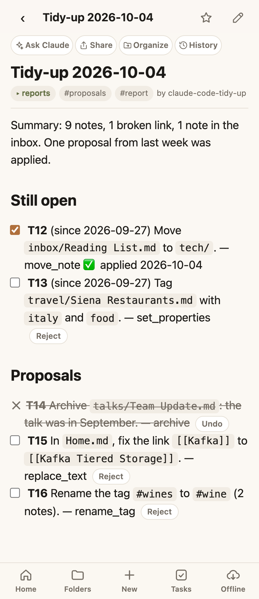

# Proposals

Let an agent suggest changes, and decide each one with a tap. The agent writes what it would do as a list of checkboxes. You **tick** the ones you want and **reject** the ones you don't. On its next run the agent does the ticked ones and nothing else.

It is the safe way to hand an agent real work: tidying your vault, handling bills, preparing emails. Nothing happens until you say yes, and every answer is a line in a note with a history.

<div class="shots" markdown>
<figure markdown>

<figcaption>A report of proposals: tick to approve, Reject to turn down</figcaption>
</figure>
</div>

!!! note "Unibrain doesn't ship the agent"
    Proposals is a convention for checkbox lines, plus what the web app does with them. The agent is yours: any AI connected to your vault, following instructions you write. Two complete examples are below.

## What a proposal looks like

A checkbox line that starts with an ID in bold:

```markdown
- [ ] **T15** In Home.md, fix the link [[Kafka]] to [[Kafka Tiered Storage]]. — replace_text
```

| The line starts | It means |
|---|---|
| `- [ ] **T15**` | Waiting for your answer |
| `- [x] **T15**` | Approved: the agent does it on its next run |
| `- [-] **T15**` | Rejected: the agent never does it and never suggests it again |

The ID is one to three capital letters and a number (`T15`, `G7`, `BIL3`), first thing on the line. It is what makes the line a proposal instead of an ordinary checkbox, and it stays the same for the life of the proposal, so a report can repeat last week's unanswered ones.

## Who does what

| The web app | Your agent, from its instructions |
|---|---|
| Shows each proposal with a checkbox and a **Reject** button; a rejected one is crossed out, with **Undo** | Writes the report note and gives each proposal an ID |
| Saves your answer into the note as `[x]` or `[-]`, so it is in the note's history | Reads the answers at the start of its next run |
| Keeps proposals off your [Tasks](tasks.md) page, once the report's tag is under **Not todos** | Does the approved ones and marks each line with the result |
| Lists unanswered proposals under **Needs you** in [mission control](mission-control.md), if you use it | Drops the rejected ones for good; repeats the unanswered ones under the same ID |

## Set it up

1. **Tag the reports.** Have the agent give every report note one tag, for example `proposals`.
2. **Keep them off Tasks.** Add that tag under **Not todos** in [Vault settings](settings.md). Otherwise each proposal shows up as a todo.
3. **Optional: see them in mission control.** With the [Agents page](mission-control.md) on, unanswered proposals in notes tagged `proposals` appear under **Needs you**. Using another tag? Set `proposalTag` in the [mission control settings](mission-control.md#settings-in-your-vault).

Name reports so they sort by date, such as `Tidy-up 2026-10-04`. A proposal repeated in several reports is listed once, under the newest, and one answer anywhere counts in all of them.

## Use case 1: a weekly tidy-up

A scheduled agent checks the vault for misfiled notes, broken links and messy tags, and proposes the fixes. You spend two minutes a week ticking boxes; the vault stays in order.

Run it on a timer (Claude Code headless, Hermes, or any scheduled assistant) with these instructions:

```text
You keep my Unibrain vault tidy. You only ever change what I approved.

Each run:
1. Call vault_guide and follow the rules it returns.
2. Read your reports from the last 8 weeks, in the folder reports/ (named
   "Tidy-up YYYY-MM-DD").
3. Approved: for each proposal ID on a line that starts "- [x]" and has no
   result mark yet, do exactly what the line says with the tool it names. Then
   use replace_text to append " ✅ applied YYYY-MM-DD" to every line with that
   ID, in every report. If it no longer makes sense or fails, append
   " ⚠️ skipped: <reason>" instead.
4. Rejected: an ID on any line that starts "- [-]" is turned down for good.
   Never apply it, never repeat it, and never propose the same change again
   under a new ID. A rejection beats a tick on another line.
5. Inspect the vault: vault_health, list_tags, the inbox folder, and
   recent_changes since your last report.
6. Write a new report with create_note: title "Tidy-up YYYY-MM-DD", folder
   reports, tags [proposals, report]. In it:
   - Summary: two sentences on the state of the vault.
   - "## Still open": unanswered proposals from earlier reports, same IDs,
     each with "(since YYYY-MM-DD)". Leave out any first proposed more than
     3 weeks ago, and list those once under "## Dropped".
   - "## Proposals": new ones, numbered on from the highest ID ever used.

A proposal is one line: "- [ ] **T16** <one exact change: paths, tag names,
new values>. <reason> — <tool>". One change per line, at most 20 new ones,
the most useful first.

Never delete anything (archive instead). Never rewrite my prose. Never make a
change that is not on an approved line.
```

## Use case 2: a bills and renewals watcher

A scheduled agent reads your bills note, and your email if it is connected, and proposes what to do about each thing coming due. Anything touching money or sent in your name is worth a yes first.

```text
You watch my bills and renewals. You prepare; I decide. You never pay, send,
cancel or sign up for anything yourself.

Each run:
1. Call vault_guide. Read home/Bills.md and your reports from the last
   6 weeks in reports/ (named "Bills YYYY-MM-DD").
2. Approved: for each proposal ID on a line that starts "- [x]" with no
   result mark, do what it says inside the vault: add the entry to the log in
   home/Bills.md, add a dated todo, or write the draft email as a new note.
   Then append " ✅ done YYYY-MM-DD" to every line with that ID.
3. Rejected: an ID on a line that starts "- [-]" is turned down. Leave it
   alone and do not raise the same bill again until its next cycle.
4. Look for: bills due in the next 30 days, renewals at a higher price than
   last time, and subscriptions my notes say I no longer use.
5. Write a report with create_note: title "Bills YYYY-MM-DD", folder reports,
   tags [proposals, report]. First "## Still open" (unanswered, same IDs),
   then "## Proposals" (new, numbered on from the highest ID ever used).

A proposal is one line with the amount and the date, for example:
"- [ ] **B7** Car insurance, €412, renews 30 Nov (was €389). Add a todo
'Compare car insurance quotes' due 15 Nov. — append_to_note"
"- [ ] **B8** Draft an email cancelling the unused gym membership, as a note
in home/drafts. — create_note"

Never write account numbers, card numbers or passwords into a note.
```

## Tips

- **Rejecting is better than ignoring.** An ignored proposal comes back every week; a rejected one is gone.
- **Changed your mind?** Tap **Undo** on a rejected line, or untick an approved one, any time before the agent's next run.
- **Ask in chat instead:** *"Approve T13 and T16 in the latest tidy-up report, reject T15."* Any connected agent can edit the lines for you.
- **Keep each line exact.** "Move `inbox/Rome.md` to `travel/`" can be approved at a glance; "tidy the inbox" cannot.
- **Start strict.** Once you trust an agent with a kind of change, let its instructions say it may do that kind without asking.

The author's own vault has a tidy-up agent built exactly this way, called the gardener. It is one person's agent, not part of Unibrain; yours can do something else entirely.
