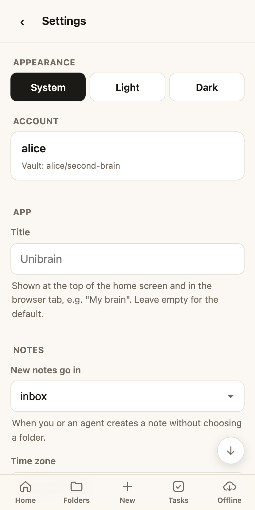

# Vault settings

Your vault, your conventions. Settings live **in your vault** as `.brain/settings.json`, so the web app, the MCP tools and every agent follow the same rules. Change them under **⚙ Settings** in the web app.

<figure markdown>

<figcaption>Settings, in the app</figcaption>
</figure>

| Setting | What it does | Default |
|---|---|---|
| **Title** | The app's name in the header and tab, e.g. "My brain" | Unibrain |
| **New notes go in** | Where notes go when no folder is given | Top level |
| **Time zone** | Dates in notes and the daily note | Taken from your device on first sign-in |
| **Archive folder** | Where archived notes go | `Archives` |
| **Not todos** | Notes with these tags hold lists or reports, not todos: their checkboxes stay off Tasks | none |
| **Todo tag** | Marks a real action inside one of those notes, which still shows on Tasks | `todo` |
| **Hide from Recent** | Notes that never show in Recently changed: a file name, a full path, or a folder | none |
| **Slides** | Default theme, colours, page numbers and shape for [slide decks](slides.md) | Default theme, light, no numbers, 16:9 |
| **Ask button opens** | Which AI the Ask button on a note opens: Claude, ChatGPT or Gemini | Claude |
| **Ask prompt** | The prompt the Ask button sends (`{path}` is the note) | a neutral prompt |
| **Agents page (alpha)** | Turns on [Mission control](mission-control.md), where your server offers it | Off |

## On this device

Some choices belong to the device rather than the vault, so your phone and your computer can differ:

- **Appearance:** System, Light or Dark.
- **Offline folders** and which Tasks sections you keep open.

Settings also links to these docs and to your [usage stats](stats.md).

## Safe by design

- **No file is fine:** defaults apply until you change something.
- **You edit a form, not the file.** Every value is checked before it's saved.
- **A broken file can't break the app.** If an agent or a hand edit damages it, each bad value falls back to its default and the problem is shown in Settings and in *vault health*.
- Agents read your settings in their vault guide and never edit the file.
