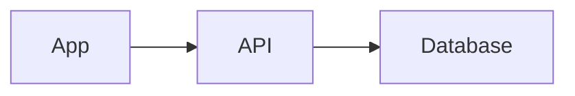

# Slides

Turn any note into a presentation. Unibrain shows [Marp](https://marp.app) decks as slides: write them in Markdown, present them from your phone or laptop, and save them as a PDF.

## Write a deck

Add `marp: true` to the note's properties and separate slides with a line of `---`:

````markdown
---
marp: true
title: Quarterly review
paginate: true
---

# Quarterly review

What changed, what's next.

---

## Highlights

- Shipped the new onboarding
- Support tickets down 30%

---

## How it fits together


````

Or just ask: *"Turn my notes on the Tuscany trip into a 6-slide deck in Unibrain."*

## Read, present, export

- **Stacked view:** opening the note shows every slide, one under another, scaled to your screen, so you can skim a deck like a note.
- **Present:** one slide at a time, full screen. Swipe, tap the right or left side, or use the arrow keys. Tap any slide to start from it.
- **PDF:** opens your device's print dialog with one slide per page; choose **Save as PDF**. On iPhone: Print, pinch the preview open, then Share → Save to Files.

## Everything works inside slides

- `[[wiki links]]` and `#tags`
- images from your vault, with sizes (``)
- [diagrams](diagrams.md): Mermaid and all 25 server-drawn types
- math, tables and code
- Marp's own features: themes (`theme: gaia`), page numbers (`paginate: true`), and per-slide classes (`<!-- _class: lead -->`)

Decks work [offline](offline.md) like any other note, and the editor's preview shows the slides as you write.

!!! note "Safe by default"
    As everywhere in Unibrain, raw HTML and scripts in a note are never run, in slides too.
