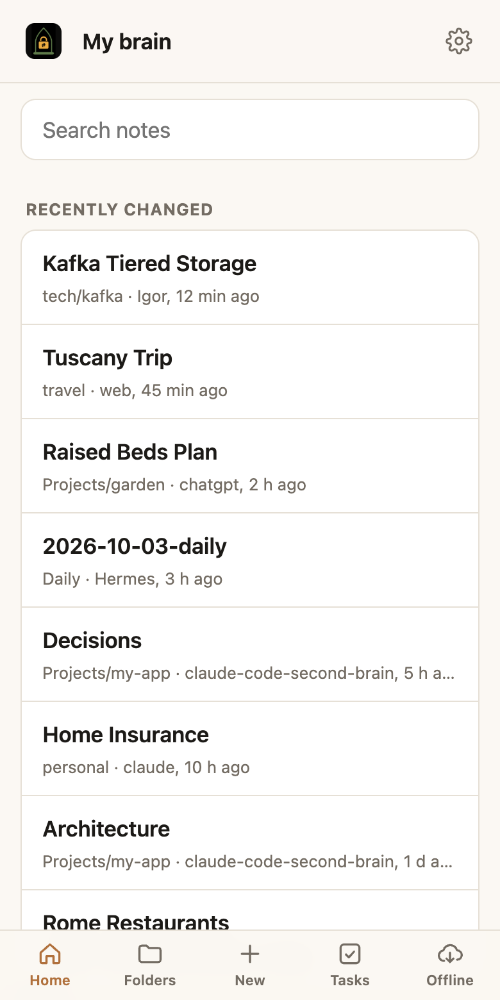
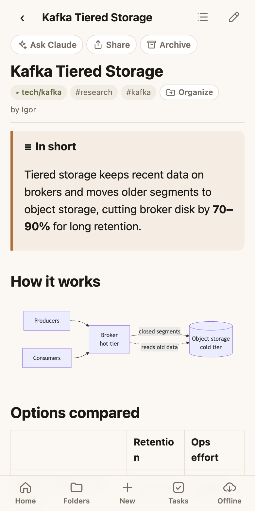
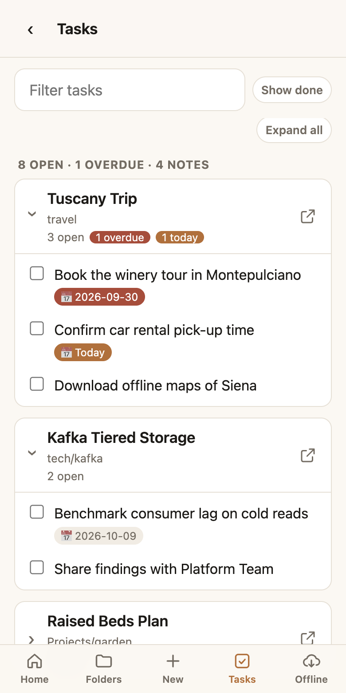
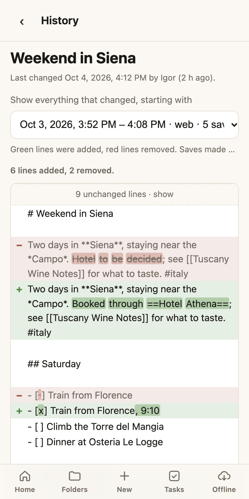

# The web app

The web app is where you **read, review and write**: what your agents saved, and your own notes. It is designed for the phone first and works as well on a computer. Open **[unibrain.dev](https://unibrain.dev)** and add it to your home screen.

<figure markdown>

<figcaption>Search and recent changes</figcaption>
</figure>
<figure markdown>

<figcaption>Reading a note</figcaption>
</figure>
<figure markdown>

<figcaption>Tasks</figcaption>
</figure>

## Getting around

- A **tab bar** at the bottom: Home, Folders, New, Tasks, Offline.
- **Pull down** at the top of any screen to refresh it.
- **Back keeps your place:** your scroll position, search results and expanded lists.
- **Back-to-top** and **jump-to-bottom** buttons on long pages, handy for logs whose newest entries are at the end.

## Search

- Words, `#tags`, or both: `#italy wine` finds notes tagged *italy* that mention *wine*. Nested tags count.
- **Tap a tag** on any note to see everything with that tag.
- Opening a result **highlights your words** and jumps to the first one.
- Offline, search runs over the notes saved on your phone.

## Reading

- Clean typography in **light and dark mode**: follow your device, or choose one under ⚙ Settings → Appearance (remembered per device).
- **Rendered beautifully:** wiki links and embeds, callouts, highlights, footnotes, block links, [26 diagram types and math](diagrams.md), syntax-highlighted code.
- **Contents** button for long notes, and **Linked from** listing the notes that link here.
- **Tap any image or diagram** to view it full screen, with pinch to zoom.
- **Tick checkboxes** right in the note.
- Tap a link to a note that **doesn't exist yet** to create it.
- **Ask** opens a chat about the note in the AI you chose in Settings: Claude, ChatGPT or Gemini. **Share** copies the note's text, or sends the `.md` file through your phone's share sheet.
- Notes marked as [slides](slides.md) open as a deck you can present or save as a PDF.

## History

Every change to a note is kept. Tap **History** on a note to see what changed.

<figure markdown>

<figcaption>What changed, and who changed it</figcaption>
</figure>

- **Pick a set of changes** from the list, each with its date and who made it. You see everything that changed from that point to now.
- **Added lines are green, removed lines red.** In a line that was edited, the changed words are marked.
- Long unchanged stretches are **folded**; tap one to open it.
- Saves made close together by the same person or agent are **one entry**, so an editing session doesn't fill the list.
- History follows a note through **renames and moves**.

It is the quickest way to check what an agent did to a note. History shows the differences; it doesn't restore an old version.

## Writing and organizing

- An editor that shows the note **formatted as you type**, with a toolbar that sits on the keyboard, note and tag suggestions, a properties form and photos from your phone. It saves by itself and never overwrites changes made elsewhere. See [Writing](editor.md).
- **New note** in any folder, or in a new subfolder.
- **Organize:** rename, move and retag in one step, with links updated everywhere.
- **Archive** with **Undo**, and **Unarchive** to restore.

## And more

- [Tasks](tasks.md): every todo in one place.
- [Offline reading](offline.md): whole folders on your phone.
- [Vault settings](settings.md) and [Usage stats](stats.md), under ⚙ Settings.
- Your own **app title**, such as "My brain", in Settings.
