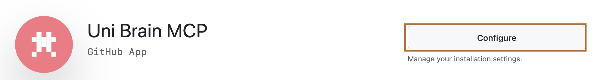

# 2. Install the GitHub App

The **Uni Brain MCP** GitHub App is how Unibrain reaches your vault, and **only your vault**.

1. Open **[github.com/apps/uni-brain-mcp](https://github.com/apps/uni-brain-mcp)** and click **Install** (or **Configure** if you've installed it before).

    { .screenshot }

    The button reads **Install** the first time. It reads **Configure**, as in this picture, once the app is on your account.

2. Choose **your account**.
3. Select **Only select repositories** and pick your vault repo. Don't choose "All repositories".
4. Review the permissions GitHub shows, then click **Install**.

## What the app can do

| Permission | Why |
|---|---|
| **Contents: read and write** | Read your notes and commit changes to them |
| **Metadata: read-only** | Required by GitHub for every app (repo name, visibility) |

Nothing else: no access to your other repos, issues, settings, email or profile.

!!! success "You stay in control"
    See or change the app's access any time at GitHub → **Settings → Applications → Installed GitHub Apps → Uni Brain MCP → Configure**. **Uninstall** it there to cut off access immediately.

[Next: request access :material-arrow-right:](access.md){ .md-button .md-button--primary }
