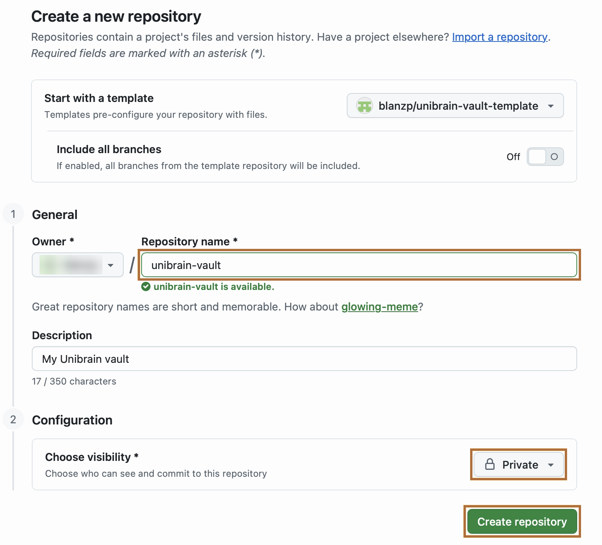
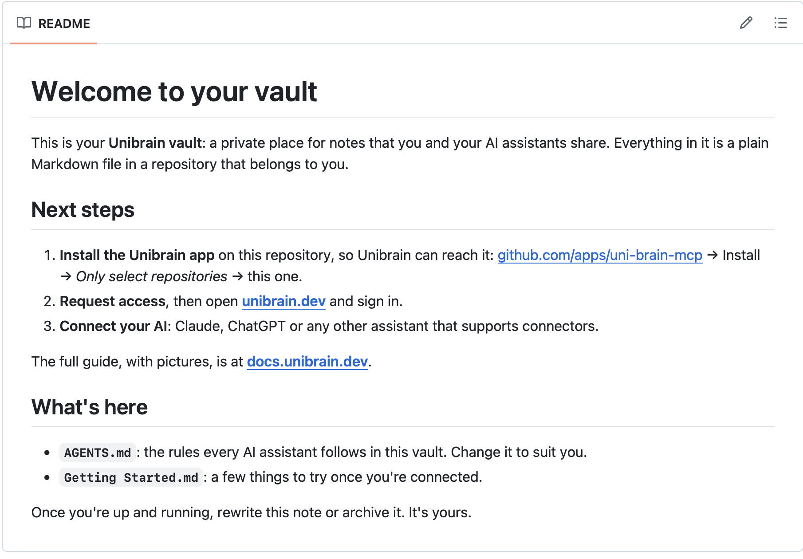

# 1. Create your vault

Your **vault** is a private GitHub repository of Markdown notes. It belongs to you, and Unibrain only ever works inside it.

## Create the repository

The quickest way is to start from the **starter vault**, which comes with a welcome note, a short list of things to try, and a set of rules for your AI assistants.

[Create my vault from the starter :material-github:](https://github.com/new?template_owner=blanzp&template_name=unibrain-vault-template&name=unibrain-vault&visibility=private&description=My+Unibrain+vault){ .md-button .md-button--primary }

GitHub opens its "Create a new repository" form with everything filled in:

1. **Repository name:** `unibrain-vault` is suggested; change it to anything you like, such as `notes` or `second-brain`.
2. Check that **Private** is selected. Only you, and the apps you allow, can see a private repo.
3. Click **Create repository**.

{ .screenshot }

That's it: your vault exists. GitHub shows your new repository, with the welcome note and its next steps:

{ .screenshot }

You can see what the starter contains before you begin at [github.com/blanzp/unibrain-vault-template](https://github.com/blanzp/unibrain-vault-template).

??? note "Starting empty, or using a repo you already have"
    **An empty vault:** go to [github.com/new](https://github.com/new), give it a name, choose **Private**, tick **Add a README file** so the repo isn't empty, and click **Create repository**.

    **An existing repo:** any repo of Markdown notes works, including an Obsidian vault. Folders, links, tags and attachments are understood as they are. There is nothing to create; go straight to the next step.

## Tell your AI what the vault is for

Your vault has a file called **`AGENTS.md`** at the top (the starter includes one; in an empty vault, add it on GitHub with **Add file → Create new file**). Unibrain sends it to every AI app each time it connects, so all of them follow the same rules: where notes go, how you like them written, what never to store.

Edit it whenever you like, in the Unibrain app or on GitHub; changes apply within a minute. The starter's version looks like this:

```markdown
# Rules for AI assistants

## What this vault is for
A shared brain for me and my AI assistants. I read and write it on my phone; assistants add to it
when I ask them to research, summarize or record something. Write so either of us can pick up
where the other left off: clear, self-contained, summary first.

## Where notes go
- `Projects/<name>/` — things I'm working on
- `Areas/<name>/` — ongoing responsibilities (home, health, finances…)
- `Resources/<topic>/` — reference material and research
- `Archives/` — finished or inactive material (only move things here when I ask)
- `inbox/` — when unsure where something belongs

## Rules
- Search before creating, to avoid duplicates; add to an existing note instead.
- Cite sources with links.
- Link related notes with [[Note Name]] only if they exist. Before finishing a new note, link it
  to the notes it is clearly related to.
- Edit notes directly when a change is small. Ask me before rewriting most of a note, changing
  several notes at once, or renaming and moving things.
- Never store passwords, API keys or account numbers — write where they're kept instead.
- If your instructions give you a name, pass it as `agent` on every tool that writes.
```

The folders above follow the popular PARA method. Use any structure you like and describe it here. More ideas: [Write your AGENTS.md](../guides/agents-md.md).

[Next: install the GitHub App :material-arrow-right:](github-app.md){ .md-button .md-button--primary }
