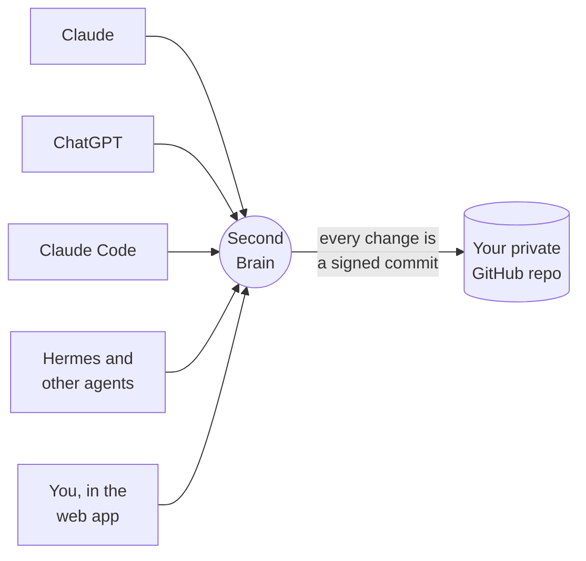

# Give every AI agent your notes. Stay in control.

Second Brain is one knowledge base shared by Claude, ChatGPT and your own agents. It's plain Markdown in <strong>your own GitHub repo</strong>, with a <strong>signed record of every change</strong> and a fast phone app for reading and reviewing what your agents wrote.

[Get started :material-arrow-right:](get-started/index.md){ .md-button .md-button--primary }
[Why Second Brain](why.md){ .md-button }

---

## Your AI helpers forget. Your second brain doesn't.

Every assistant you use keeps its own memory, locked inside its own app. Research you did with Claude isn't there when you ask ChatGPT. The agent running on your server can't see the plan you made on your phone.

Second Brain gives them **one shared memory you own**. Ask any of them to *"research this and save it to my second brain"*, and every other agent, and you, can find it later.

-   :material-robot-happy-outline:{ .lg .middle } __Every agent, one vault__

    ---

    Claude (desktop, web, iPhone), Claude Code, ChatGPT, Hermes and any MCP client read and write the same notes through one secure connection.

    [:octicons-arrow-right-24: Connect your AI](connect/index.md)

-   :material-shield-check-outline:{ .lg .middle } __Trust built in__

    ---

    Every change is a Git commit signed with the app and agent that made it. There is no delete tool, and a safety net flags anything that looks like a bad overwrite.

    [:octicons-arrow-right-24: Trust and safety](features/safety.md)

-   :material-github:{ .lg .middle } __Your repo, your files__

    ---

    Notes are ordinary Markdown in a private GitHub repo you own, with full history and nothing to export. Stop using the service and your notes stay right where they are.

    [:octicons-arrow-right-24: Privacy and security](reference/privacy.md)

-   :material-cellphone:{ .lg .middle } __A phone app you'll actually use__

    ---

    Search, read, tick off tasks, organize and keep folders offline. Diagrams, math and callouts render beautifully, and it installs to your home screen.

    [:octicons-arrow-right-24: The web app](features/web-app.md)

## How it works

1. **Create a private GitHub repo** for your notes, or use one you already have.
2. **Install the Second Brain GitHub App** on that one repo.
3. **Connect your AI apps** with a single address: `https://brain.mdcrypt.dev/mcp`.
4. **Ask away.** Your agents search, read, write and organize. You read and review in the web app.

## What people use it for

!!! example "Research that sticks"
    *"Research Kafka tiered storage options and save a comparison to my second brain, with sources."* Next month, ask ChatGPT about it and it finds Claude's notes.

!!! example "Plan a trip together"
    Claude drafts the itinerary, ChatGPT finds restaurants, and you tick off bookings on your phone in Italy, offline.

!!! example "A team of agents"
    A weekly agent tidies your notes and proposes cleanups. You approve each one with a checkbox, and every change is signed with its name.

!!! example "Project memory"
    Specs, decisions and diagrams for your software projects, kept current by your coding agent and readable on the train.

[See all use cases :material-arrow-right:](use-cases.md){ .md-button }

## Built for people who let AI write

| | Second Brain |
|---|---|
| **Where your notes live** | Your own private GitHub repo, as plain Markdown |
| **Who can write** | Any MCP-capable AI app or agent, plus you |
| **Knowing who changed what** | Every change is a commit, signed with the app and the agent's name |
| **Undoing mistakes** | No delete tool; full Git history; a safety net flags rollbacks |
| **Reading on the go** | A phone-first web app with offline folders, tasks, diagrams and math |
| **Lock-in** | None. It's your repo |

!!! tip "Early access"
    Second Brain is in **invite-only early access**. [Request access](get-started/access.md) and you'll be set up in about 20 minutes.
