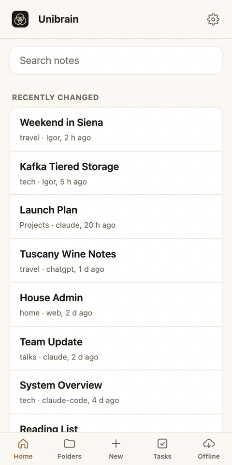

# Use cases

Real ways to put a shared, accountable memory to work. Every prompt below works in Claude, ChatGPT or any connected agent.

<figure markdown>

<figcaption>Ask an agent to save something, and it is on your phone</figcaption>
</figure>

## Research that sticks

Research is wasted when it disappears into a chat history. Save it once and every assistant can build on it.

> Research Kafka tiered storage: how it works, the main options, and the trade-offs. Save it to Unibrain under tech/kafka with sources and a comparison table.

Next month, from a different app:

> What did we find out about Kafka tiered storage? Has anything changed since?

!!! tip "Why it works"
    Notes are written as plain Markdown with links and sources, so they're readable on your phone and searchable by every agent. The note records which agent wrote it and when.

## Plan a trip together

Let several assistants do what they're best at, while you stay on top of it from your phone.

1. *"Draft a 10-day Tuscany itinerary and save it as travel/Tuscany Trip, tagged #itinerary."*
2. *"Find three wineries near Montepulciano that take bookings and add them to my Tuscany Trip note."*
3. Real actions get a due date: `- [ ] Book the winery tour #todo 📅 2026-10-05`. They show up on your **Tasks** page; the sightseeing list doesn't clutter it.
4. Before you fly, tap ☁︎ on the `travel` folder to **keep it offline**. Maps, plans and bookings are on your phone without a signal.

## Your project's living memory

Specs, decisions, architecture diagrams and a roadmap, kept current by the agents that do the work.

> Read Projects/my-app/Architecture before you start. When you're done, add today's decisions to the Decisions note and update the roadmap.

- Draw the architecture as a **C4 or PlantUML diagram** in the note; the web app renders it, and you can zoom in with a tap.
- **Ask Claude** from any note on your phone to discuss it on the go.
- `recent_changes` and the web app's **Recently changed** list show what your coding agent touched.

## A daily log, from anywhere

> Add to today's daily note: called the plumber, quote is $400, he can come Thursday.

The note is created if it doesn't exist, with a timestamp, in your own time zone. Later:

> What did I log about the plumber last month?

## Personal admin you can find again

Property taxes, warranties, insurance renewals, health appointments: the things you need once a year and can never find.

> Save the details from this property tax bill to personal/Property Taxes, and add a todo for the second payment due 16 December.

!!! warning "Never store secrets"
    Write *where* a password or account number is kept, never the value itself. Your `AGENTS.md` can tell every agent the same rule.

## A team of agents, with you in charge

Give each agent a job and a name, and let them work in the same vault:

- **A research librarian** (a Claude Project named Igor) that files findings carefully.
- **A brainstorming partner** that turns conversations into plans.
- **A weekly tidy-up agent** that checks for broken links, duplicates and misfiled notes, and writes its [proposals](features/proposals.md) to a report. You tick or reject each one on your phone; only then does it act.
- **An always-on assistant** (Hermes) that you message from Telegram.

Every change shows who made it: `Igor (claude)`, `claude-code-tidy-up`, or whatever name you gave Hermes. If something looks wrong, the history shows exactly what happened, and the safety net flags anything that rolled notes back. See [Run a team of agents](guides/multi-agent.md).

## Brainstorm, then keep the good parts

> Let's brainstorm names for the new product. When we're done, save the shortlist and the reasons to Unibrain and link it from the project hub.

Agents link related notes with `[[wiki links]]` (only to notes that exist), so ideas don't end up as orphans.

## Diagrams that explain themselves

Ask for a picture instead of a wall of text:

> Draw the sign-in flow as a sequence diagram in the Architecture note.

Unibrain draws **26 diagram types**: Mermaid, PlantUML, C4, Graphviz, D2, Structurizr, Vega-Lite charts, network and rack diagrams, wiring harnesses and more. See [Diagrams and math](features/diagrams.md).

## Keep your knowledge healthy

> Check my vault's health and propose fixes.

You get broken links, orphan notes, ambiguous names and empty notes, plus any suspicious commits in the last 30 days. Agents can fix links safely because moves and renames rewrite every link across the vault.
