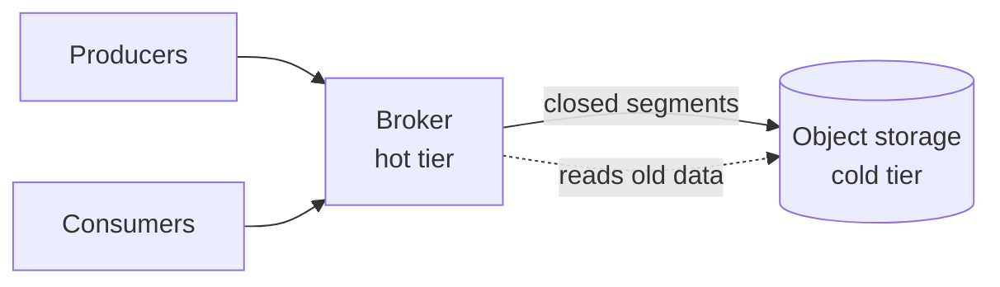

# Kafka Tiered Storage

> [!abstract] In short
> Tiered storage keeps recent data on brokers and moves older segments to object storage, cutting broker disk by **70–90%** for long retention.

## How it works

## Options compared

| | Retention | Ops effort |
|---|---|---|
| Local disks only | days | low |
| Tiered storage | months | medium |
| Separate archive | years | high |

## Next steps

- [ ] Size the hot tier for seven days #todo 📅 {{+8d}}
- [ ] Try it on the staging cluster #todo
