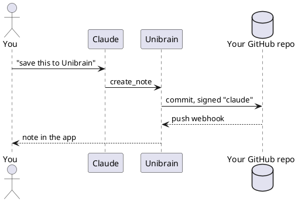
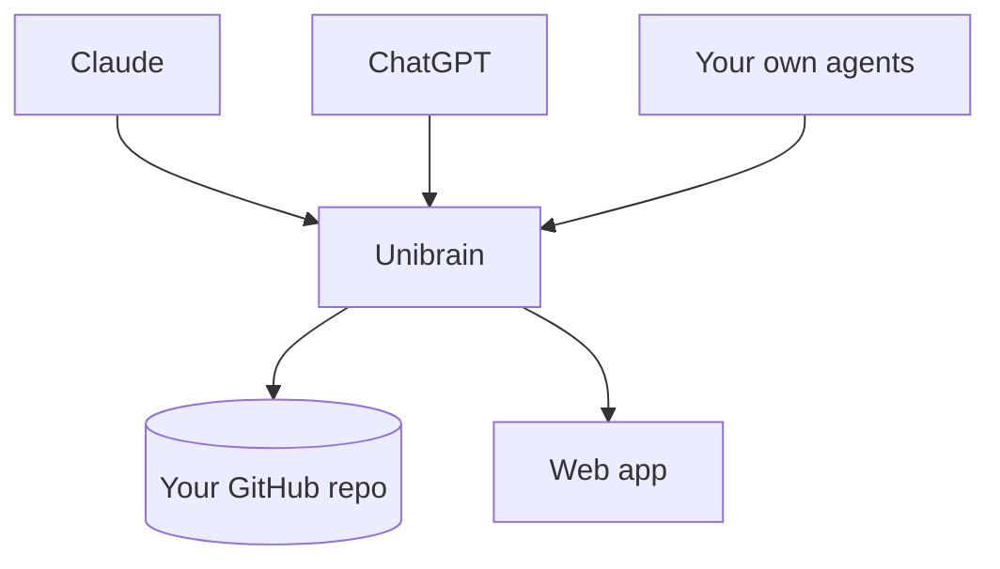

# System Overview

How a note travels from an agent to your phone.

The same flow as a picture of the parts:

Sync time is roughly $t = t_{push} + t_{webhook}$, about a second:

$$
t \approx 0.3\,\mathrm{s} + 0.7\,\mathrm{s}
$$
