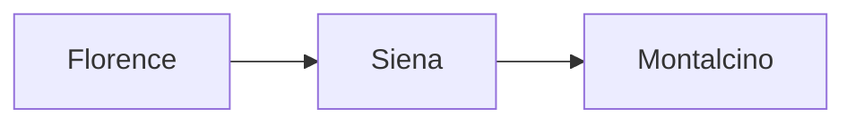

# Weekend in Siena

Two days in **Siena**, staying near the *Campo*. Booked through ==Hotel Athena==; see [[Tuscany Wine Notes]] for what to taste. #italy

## Saturday

- [x] Train from Florence, 9:10
- [ ] Climb the Torre del Mangia
- [ ] Dinner at Osteria Le Logge

> [!tip] Book ahead
> The Duomo floor is only uncovered in **autumn**. Reserve a slot online.

## Costs

| Item | Each | For two |
|:-----|-----:|--------:|
| Train | 10 | 20 |
| Duomo pass | 16 | 32 |
| Dinner | 45 | 90 |

## Route

Sunday is for the hills: drive south and stop wherever looks good.
